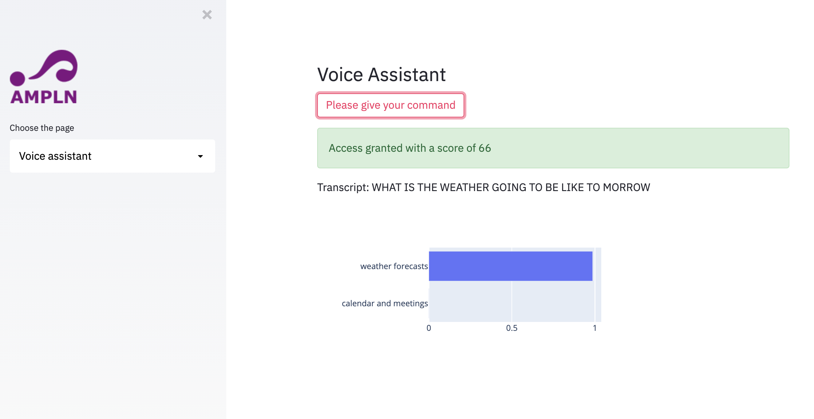

# Mexican NLP Summer School

## An introduction to speech-based technologies for Natural Language Processing applications

This repository contains the code for the workshop given at the Mexican NLP Summer School.

### How to install

```bash
pip install -r requirements.txt
```

### How to run the app

```bash
streamlit run app.py
```

## What it does

After enrolling the speaker, it verifies the voice identity of the speaker, runs ASR transcripts, and identifies the topic of your query:

