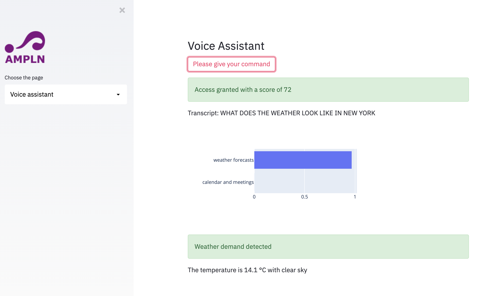

# Mexican NLP Summer School - Demo

## An introduction to speech-based technologies for Natural Language Processing applications

This repository contains the code for the workshop given at the Mexican NLP Summer School. The link to the slides is [here](https://docs.google.com/presentation/d/1bXqvxy0KQnI3AhsncHj_26p1WdE-UKErplUBJ5BBANI/edit?usp=sharing).

### How to install

```bash
git clone https://github.com/maelfabien/NLP_Summer_School-2021_Speech_Demo
conda create --name nlp_summer_school python=3.8
conda activate nlp_summer_school
pip install -r requirements.txt
pip install spacy-streamlit --pre
python -m spacy download en_core_web_sm
```

### Get your weather forecast API key

You can directly get your key here: https://openweathermap.org/api. You need to sign-up, and click on your profile, and "My API Keys". Finally, paste it in `src/key.txt`

### How to run the app

```bash
streamlit run app.py
```

## What it does

After enrolling the speaker, it verifies the voice identity of the speaker, runs ASR transcripts, and identifies the topic of your query:


